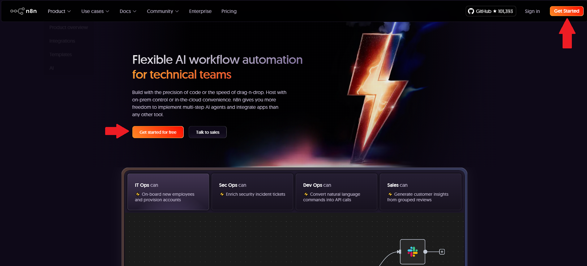
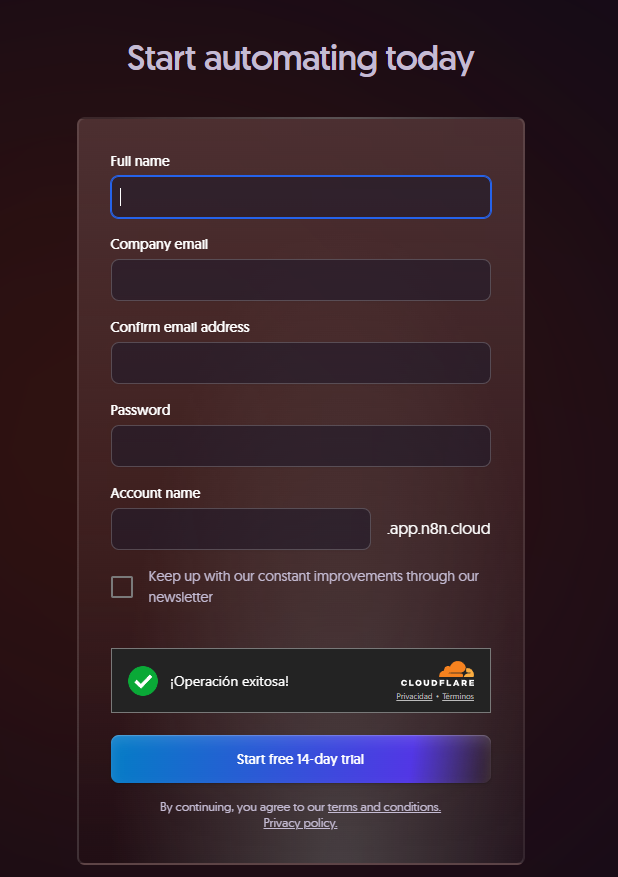
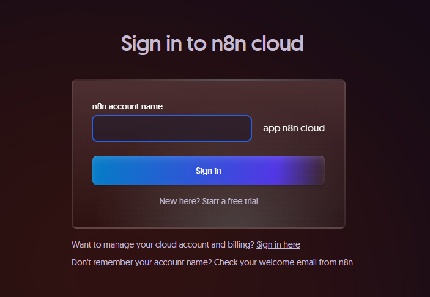
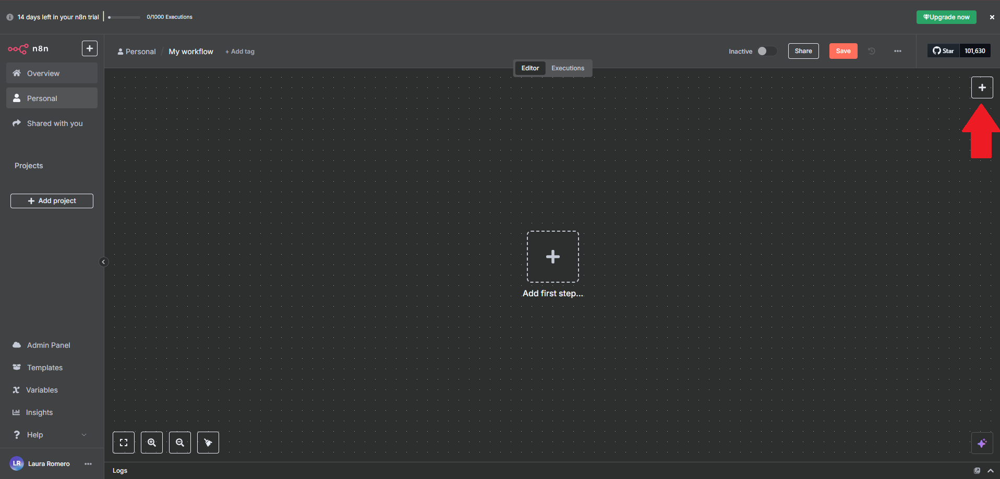
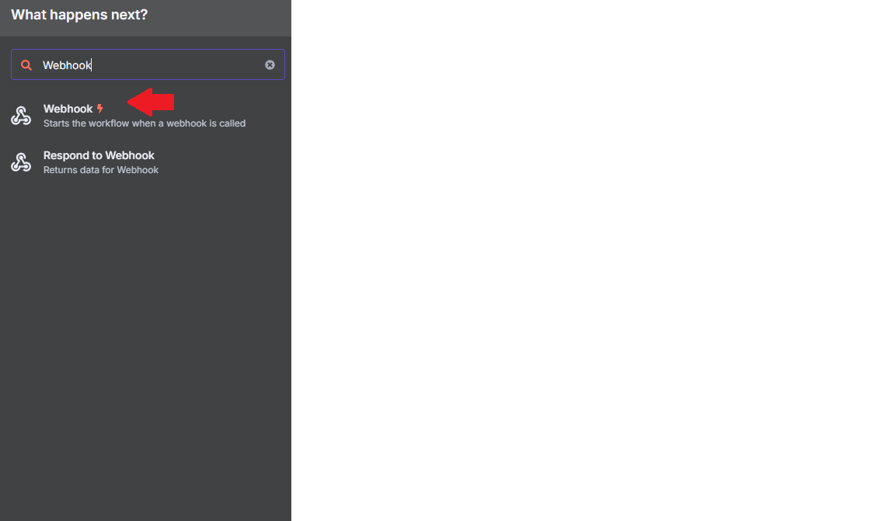

## Pasos para comenzar

 **Ingresa al sitio oficial**  
   Abre tu navegador y ve al siguiente enlace:  
   👉 [https://n8n.io/](https://n8n.io/)

 **Crea una cuenta nueva**  
   Haz clic en el botón `Get started` ubicado en la página principal.
     

 **Regístrate**  
   Llena el formulario de registro con tus datos. Asegúrate de definir un **nombre de usuario** que utilizarás para ingresar posteriormente.

   

 ## Crear un nuevo flujo en n8n

Haz clic en el botón **"New Workflow"** 

   


Haz clic en el ícono **`+`** ubicado en la parte superior izquierda para agregar un nuevo nodo.

  


## 🔧 Pasos para construir el flujo

### 1. Crear el nodo Webhook

   

- Agrega un nodo **Webhook**.
- Método: `GET`
- Selecciona: "Respond with other node".


---

### 2. Agrega un nodo **Code**

Este nodo genera:
- Un nombre personalizado
- Un campo `Ambiente`
- Un número aleatorio del 1 al 1025 para obtener un Pokémon.

```javascript
for (const item of $input.all()) {
  item.json.displayName = "Malubita";
  item.json.Ambiente = "-test";
  item.json.RandomPokemon = Math.floor(Math.random() * 1025) + 1;
}
return $input.all();
```
### 3. Nodo HTTP Request - Consultar PokéAPI

- **Método:** `GET`  
- **URL:**

```bash
https://pokeapi.co/api/v2/pokemon/{{ $json.RandomPokemon }}
```
⚙️ Este paso permite obtener los datos del Pokémon generado aleatoriamente.

### 4. Nodo HTML

- Operación: Generate HTML Template
- Contenido: copia el HTML desde el archivo index.html incluido en este repositorio.

Puedes utilizar expresiones dentro del HTML como:
```bash
{{ $('Code').item.json.displayName }}
```
🖼️ Esto permite insertar valores dinámicos en la plantilla HTML.

### 5. Nodo Respond to Webhook

-Tipo de respuesta: Text
-Contenido de respuesta:

```bash
{{ $json.html }}
```
✅ Este paso devuelve el HTML generado al cliente que realizó la solicitud al Webhook.

