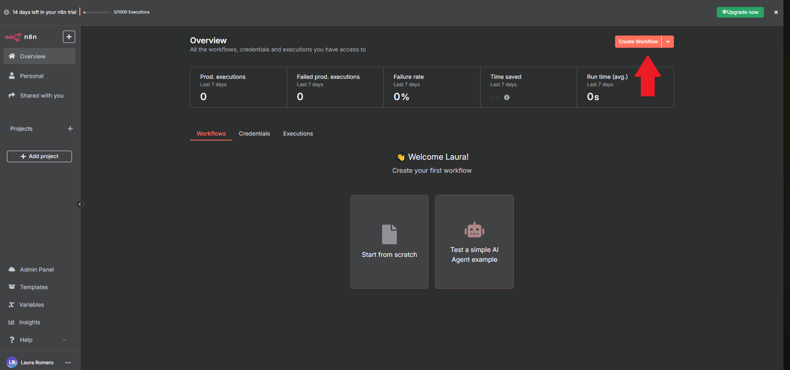
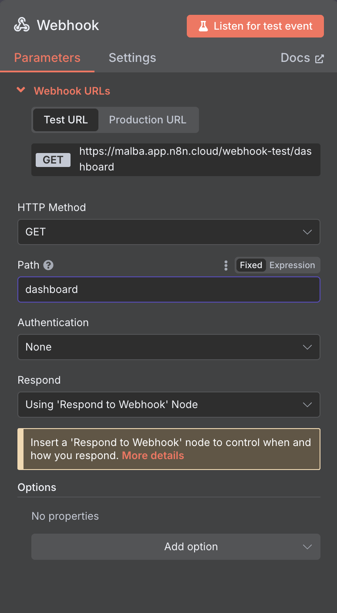
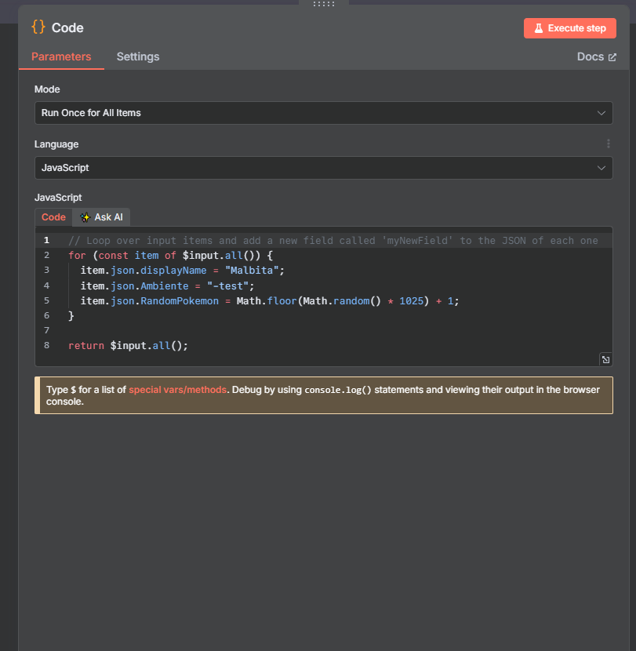
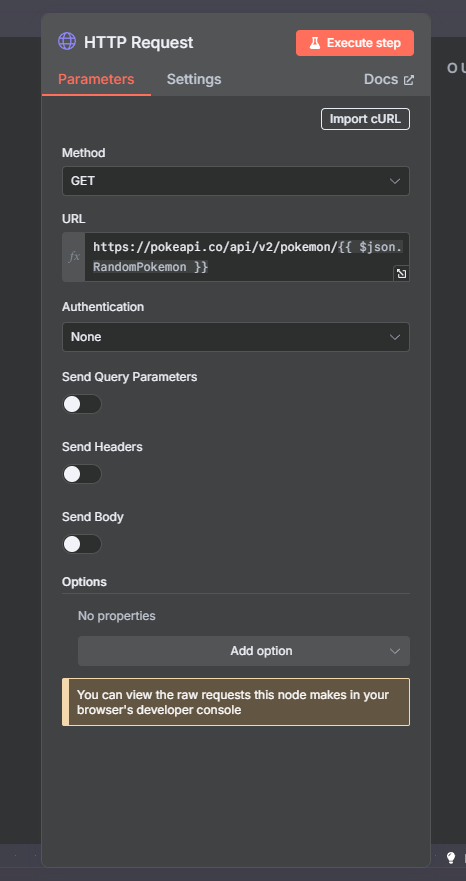
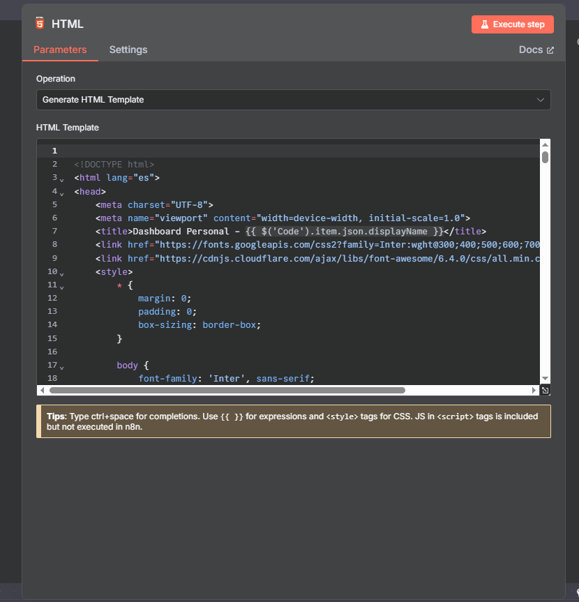
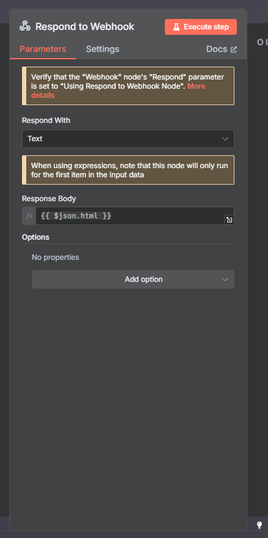
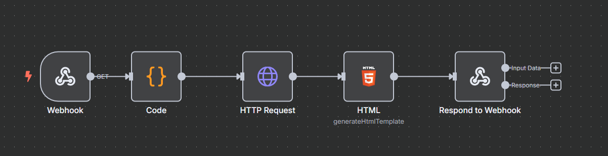
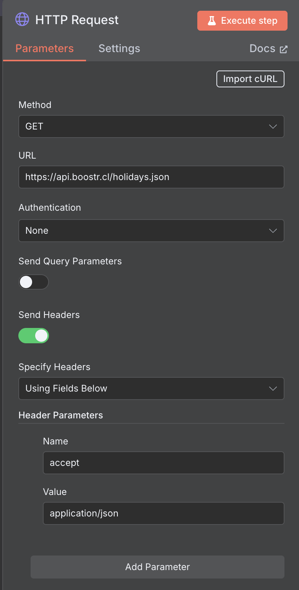

## Pasos para comenzar

 **Ingresa al sitio oficial**  
   Abre tu navegador y ve al siguiente enlace:  
   👉 [https://n8n.io/](https://n8n.io/)

 **Crea una cuenta nueva**  
   Haz clic en el botón `Get started` ubicado en la página principal.
     

 **Regístrate**  
   Llena el formulario de registro con tus datos. Asegúrate de definir un **nombre de usuario** que utilizarás para ingresar posteriormente.

   

 ## Crear un nuevo flujo en n8n

Haz clic en el botón **"New Workflow"** 

   


Haz clic en el ícono **`+`** ubicado en la parte superior izquierda para agregar un nuevo nodo.

  


## 🔧 Pasos para construir el flujo

### 1. Crear el nodo Webhook 

   

- Agrega un nodo **Webhook**.
- Método: `GET`
- Selecciona: "Respond with other node".
- Path: Cambiar path por dashboard



---

### 2. Agrega un nodo **Code**

Este nodo genera:
- Un nombre personalizado
- Un campo `Ambiente`
- Un número aleatorio del 1 al 1025 para obtener un Pokémon.

```javascript
for (const item of $input.all()) {
  item.json.displayName = "Malubita";
  item.json.Ambiente = "-test";
  item.json.RandomPokemon = Math.floor(Math.random() * 1025) + 1;
}
return $input.all();
```


### 3. Nodo HTTP Request - Consultar PokéAPI

- **Método:** `GET`  
- **URL:**

```bash
https://pokeapi.co/api/v2/pokemon/{{ $json.RandomPokemon }}
```
⚙️ Este paso permite obtener los datos del Pokémon generado aleatoriamente.




### 4. Nodo HTML

- Operación: Generate HTML Template
- Contenido: copia el HTML desde el archivo `index.html` incluido en este repositorio.

Puedes utilizar expresiones dentro del HTML como:
```bash
{{ $('Code').item.json.displayName }}
```
🖼️ Esto permite insertar valores dinámicos en la plantilla HTML.



### 5. Nodo Respond to Webhook

-Tipo de respuesta: Text
-Contenido de respuesta:

```bash
{{ $json.html }}
```
✅ Este paso devuelve el HTML generado al cliente que realizó la solicitud al Webhook.






😎 Genial ahora vamos a crear los siguiente workflows de feriados

### 1. Crear el nodo Webhook

   

- Agrega un nodo **Webhook**.
- Método: `GET`
- Selecciona: "Respond with other node".
- Path: Cambiar path por "feriados"


---

### 2. Agrega un nodo **Code**

Este nodo genera:
- Un filtro para tener los feriados del futuro

```javascript
function isFuture(dateInput) {
  const target = dateInput instanceof Date ? dateInput : new Date(dateInput);
  if (Number.isNaN(target.getTime())) {
    throw new Error('Fecha inválida');
  }
  const now = Date.now();      // Momento actual
  return target.getTime() > now;
}

for (const item of $input.all()) {
  item.json.myNewField = 1;
  item.json.data = item.json.data.filter(e=>isFuture(e.date))  
}

return $input.all();
```

### 2. Agrega un nodo **Code**

Este nodo genera:
- Un filtro para tener los feriados del futuro

```javascript
function isFuture(dateInput) {
  const target = dateInput instanceof Date ? dateInput : new Date(dateInput);
  if (Number.isNaN(target.getTime())) {
    throw new Error('Fecha inválida');
  }
  const now = Date.now();      // Momento actual
  return target.getTime() > now;
}

for (const item of $input.all()) {
  item.json.myNewField = 1;
  item.json.data = item.json.data.filter(e=>isFuture(e.date))  
}

return $input.all();
```


### 5. Nodo Respond to Webhook

-Tipo de respuesta: Text
-Contenido de respuesta:

```bash
{{ $json.data }}
```


😎😎😎 Genial ahora vamos a crear los siguiente workflows de Valores Api


### 1. Crear el nodo Webhook

   

- Agrega un nodo **Webhook**.
- Método: `GET`
- Selecciona: "Respond with other node".
- Path: Cambiar path por "feriados"


### 3. Crear HTTP Request

- Visitar el sitio  https://docs.boostr.cl/reference/holidays
- Agrega un nodo **HTTP Request**.
- Selecciona: `Import Crurl`



---

### 3. Agrega un nodo **Code**

Este nodo genera:
- Un filtro para tener los feriados del futuro

```javascript
function isFuture(dateInput) {
  const target = dateInput instanceof Date ? dateInput : new Date(dateInput);
  if (Number.isNaN(target.getTime())) {
    throw new Error('Fecha inválida');
  }
  const now = Date.now();      // Momento actual
  return target.getTime() > now;
}

for (const item of $input.all()) {
  item.json.myNewField = 1;
  item.json.data = item.json.data.filter(e=>isFuture(e.date))  
}

return $input.all();
```


😎😎😎 Genial ahora vamos a crear los siguiente workflows de Calendario

### 1. Crear el nodo Webhook

   

- Agrega un nodo **Webhook**.
- Método: `GET`
- Selecciona: "Respond with other node".
- Path: Cambiar path por "calendario"


---

### 2. Agrega un nodo **Code**

Este nodo genera:
- Un filtro para tener los feriados del futuro

```javascript
function isFuture(dateInput) {
  const target = dateInput instanceof Date ? dateInput : new Date(dateInput);
  if (Number.isNaN(target.getTime())) {
    throw new Error('Fecha inválida');
  }
  const now = Date.now();      // Momento actual
  return target.getTime() > now;
}

for (const item of $input.all()) {
  item.json.myNewField = 1;
  item.json.data = item.json.data.filter(e=>isFuture(e.date))  
}

return $input.all();
```

😎😎😎 Genial ahora vamos a crear los siguiente workflows de Calendario

### 1. Crear el nodo Webhook

   

- Agrega un nodo **Webhook**.
- Método: `GET`
- Selecciona: "Respond with other node".
- Path: Cambiar path por "calendario"


---

### 2. Agrega un nodo **Code**

Este nodo genera:
- Un filtro para tener los feriados del futuro

```javascript
function isFuture(dateInput) {
  const target = dateInput instanceof Date ? dateInput : new Date(dateInput);
  if (Number.isNaN(target.getTime())) {
    throw new Error('Fecha inválida');
  }
  const now = Date.now();      // Momento actual
  return target.getTime() > now;
}

for (const item of $input.all()) {
  item.json.myNewField = 1;
  item.json.data = item.json.data.filter(e=>isFuture(e.date))  
}

return $input.all();
```


